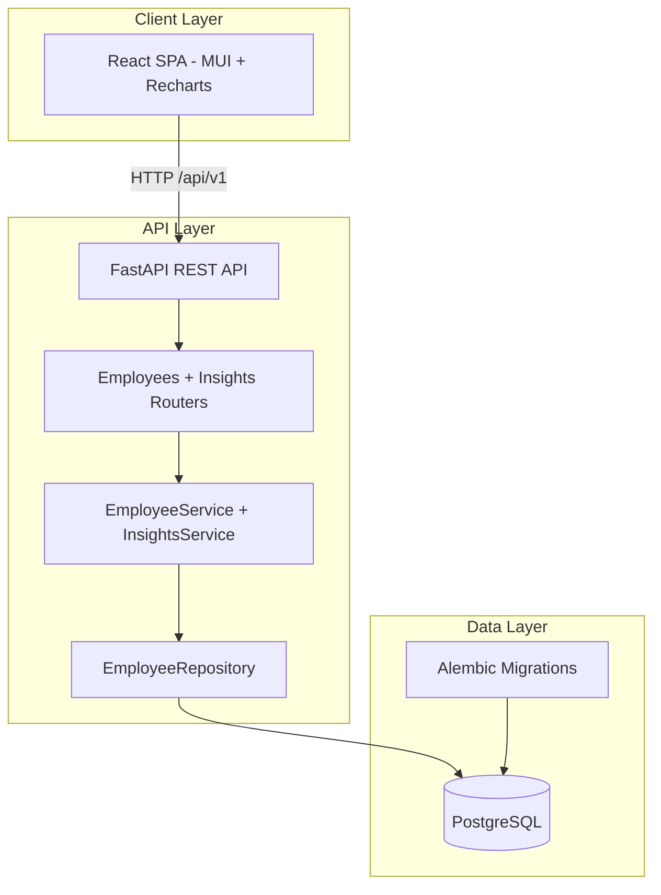
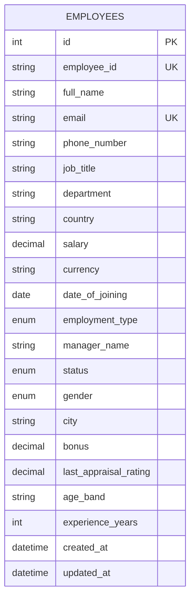

# PayBuddy Architecture

## System Overview

## Layered Backend Design

| Layer | Responsibility |
|-------|----------------|
| **API** (`app/api/routes`) | HTTP, query params, status codes |
| **Schemas** (`app/schemas`) | Pydantic validation & serialization |
| **Services** (`app/services`) | Business rules, conflict checks |
| **Repositories** (`app/repositories`) | SQLAlchemy queries, aggregations |
| **Models** (`app/models`) | ORM entities & indexes |

## Database Schema (ER)

### Indexes

- Single: `email`, `employee_id`, `country`, `department`, `job_title`, `status`, `salary`, `date_of_joining`
- Composite: `(country, department)`, `(country, job_title)`, `(status, country)`

## Scalability Decisions

1. **Pagination** — All list endpoints use offset/limit with indexed sort columns.
2. **Aggregations** — Insights use SQL `GROUP BY` / window functions in the repository (no N+1).
3. **Bulk seed** — `bulk_insert_mappings` in 1k batches; TRUNCATE for idempotent resets.
4. **Connection pool** — SQLAlchemy pool (10 + 20 overflow) for concurrent HR users.

## Seed Strategy

- **Reset**: `--reset` runs `TRUNCATE ... RESTART IDENTITY`
- **Names**: Random combinations from `first_names.txt` + `last_names.txt`
- **Target**: 10,000 rows in ~3–8s (local PostgreSQL)
- **Complexity**: O(n) generation + O(n/batch) DB writes

## Tradeoffs

| Choice | Benefit | Cost |
|--------|---------|------|
| Monolithic FastAPI | Simple deploy, fast iteration | Less service isolation |
| Offset pagination | Simple implementation | Slower on very deep pages |
| Mock auth (frontend) | Fast HR demo | Not production security |
| Median in Python | Portable across DBs | Loads salaries into memory for median/percentiles |

## API Surface

- `GET/POST /api/v1/employees`
- `GET/PUT/DELETE /api/v1/employees/{id}`
- `GET /api/v1/insights/salary/country`
- `GET /api/v1/insights/salary/job-title`
- `GET /api/v1/insights/dashboard`

OpenAPI: `http://localhost:8000/docs`
